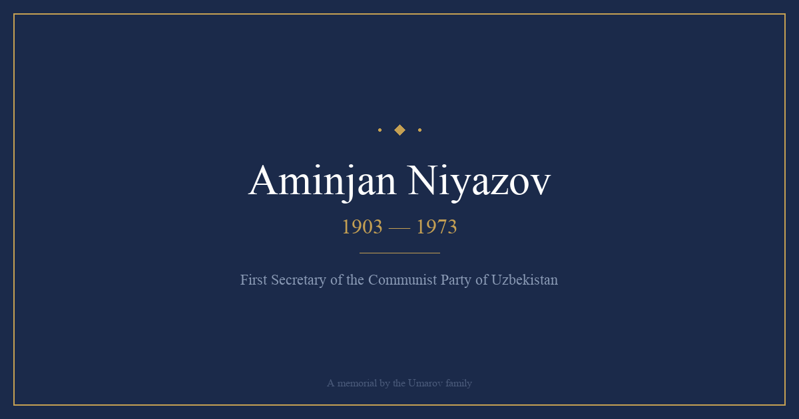

# Aminjan Niyazov Memorial

**🌐 Live: [www.amin-niyazov.com](https://www.amin-niyazov.com)**

A memorial website dedicated to **Aminjan Irmatovich Niyazov (1903–1973)** — Soviet Uzbek statesman who rose from a sharecropper's son to become First Secretary of the Communist Party of Uzbekistan.



## About

Aminjan Niyazov's life spanned the entire arc of Soviet history. He managed wartime finances as People's Commissar during WWII, built the irrigation infrastructure that fed millions, mechanized cotton harvests deploying over 22,000 machines, constructed schools and hospitals, and hosted world leaders including Jawaharlal Nehru and Indira Gandhi.

He was ultimately dismissed in 1955 by his former classmate Nikita Khrushchev in a political maneuver, bore it without bitterness, and continued serving — pioneering natural gas supply to Uzbek households and helping build the Tashkent–Kokand highway.

## Features

- 📖 **Comprehensive biography** — Early years, education, WWII service, rise to power, dismissal, and legacy
- 📸 **Photo gallery** — 7 rare historical photographs with lightbox viewer (keyboard navigation)
- 🌍 **5 languages** — English, Russian, Uzbek, French, Spanish
- 🌓 **Dark/light mode** — Respects system preference with manual toggle
- 📊 **Infobox sidebar** — Wikipedia-style reference card
- 📱 **Fully responsive** — Mobile-first design
- ⚡ **Static site** — Single HTML file, no build step, deployed on Vercel

## Key Positions

| Period | Position |
|--------|----------|
| 1950–1955 | First Secretary, Communist Party of Uzbekistan |
| 1947–1950 | Chairman, Supreme Soviet of Uzbek SSR |
| 1946–1947 | Deputy Chairman, Council of Ministers |
| 1940–1946 | People's Commissar of Finance |
| 1934–1940 | Chief Engineer, Chirchik Electrochemical Combine |

## Photo Gallery

Includes rare photographs from family archives and published memoirs:
- Official portraits (1950s and 1960s)
- Reception for PM Nehru and Indira Gandhi (1955)
- With Bulganin and Khrushchev at the Navoi Opera Theater
- Meeting Khrushchev and Rashidov at Tashkent Airport
- On the tribune at Lenin Square with Kosygin
- Party conference presidium with Khrushchev

## Tech Stack

- Pure HTML/CSS/JavaScript (no framework)
- Hosted on [Vercel](https://vercel.com)
- Custom domain via Vercel DNS
- SVG favicon, Gemini-generated OG image

## Family

Aminjan Niyazov is the great-grandfather of the Umarov family. His granddaughter married into the family, linking the Niyazov line of statesmanship with the Bobojonov line of science.

**Related memorials:**
- [Gulam Babodjanov](https://www.gulam-babodjanov.com) — Rector of the Tashkent Agricultural Institute, Scientist of Silk (1907-1955)
- [Giyas Umarov](https://www.giyas-umarov.com) — Founder of Heliotechnology, Academician (1921–1988)

## Deploy

```bash
npx vercel --prod
```

## License

© 2024 Umarov Family. All rights reserved.
